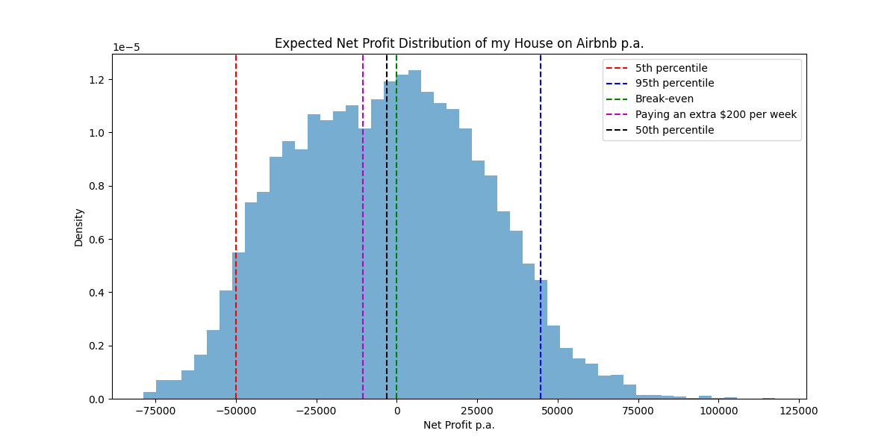

# Queenstown Airbnb Analysis and Financial Simulation

This repository provides a financial Monte Carlo simulation of my house listed on Airbnb and an additional basic analysis of the data. Specifically, I am modelling the estimate profitability of renting my houes on Airbnb under various occupancy rates, costs, and revenue scenarios. The additional exploratory data analysis provides insights into price distribution, review trends, and estimated monthly income.

Note that I have omitted the data files for privacy reasons, but you can easily replicate the analysis by following the setup instructions below. Feel free to reach out if you have any questions or need further assistance!

## Overview

The simulation combines data filtering, cost modelling, and statistical analysis for Airbnb listings to predict financial outcomes. It also includes data visualisation for listing prices and review patterns, helping to gauge listing popularity and seasonality. The simulation considers key variables like cleaning, booking, and management fees to estimate net profits, weekly costs, and revenue.

Key features:
- Aggregates monthly listing data, filters by property type, bathrooms, bedrooms, and review count.
- Performs Monte Carlo simulations of occupancy rates, stay lengths, and monthly costs.
- Visualises listing price distribution and review patterns by month.
- Provides estimated monthly income based on average review activity and price data.

## Table of Contents
- [Setup](#setup)
- [Configuration](#configuration)
- [Usage](#usage)
- [Functions](#functions)
- [Dependencies](#dependencies)

## Setup

1. **Clone the repository**:
   ```bash
   git clone <repository-url>
   cd Airbnb_Analysis
   ```

2. **Install dependencies**:
   Ensure you have Python 3.8+ and `pip` installed. Install the necessary packages with:
   ```bash
   pip install -r requirements.txt
   ```

3. **Prepare CSV files**:
   - Download data from [here](https://insideairbnb.com/get-the-data/).
   - Place monthly listing CSV files in folders named by month (e.g., `listings_jan`, `listings_feb`), each containing `listings.csv`.
   - Add a main `listings.csv` file and a `reviews.csv` file in the root directory for exploratory data analysis.

## Usage

1. **Run the data analysis and simulation**:
   Execute the script to load, filter, analyse, and simulate data for Queenstown properties:
   ```bash
   python analysis.py
   ```
   This will print profitability and income estimates, as well as display price distribution and monthly review counts.

   Execute the simulation script:
    ```bash
    python detailed_analysis.py
    ```
    This will print profitability estimates, as well as display the profit/loss distribution for my house on Airbnb.
    
2. **View Results**:
   The output includes:
   - Median price of filtered listings.
   - Estimated monthly and annual income based on review data.
   - Profitability metrics such as 5th and 95th percentile net profit and expected weekly costs.
   - Visualisations of price distribution and review count trends across months.

## Functions

- **Exploratory Data Analysis**:
  - **Price Distribution**: Filters listings by desired criteria and plots a histogram of prices.
  - **Review Trends**: Filters review data for relevant listings, calculates monthly review counts, and visualises monthly review trends.

- **Financial Simulation**:
  - **`read_all_csvs(months)`**: Reads and combines monthly listing data using multi-threading.
  - **`bounded_resample(kernel, size, lower_bound, upper_bound)`**: Samples occupancy rates within a specified range using Gaussian KDE.
  - **`simulate_monthly_cost(df, month)`**: Generates simulated nightly costs for each month.
  - **Revenue & Cost Calculations**: Simulates occupancy rates, cleaning fees, booking fees, and other costs to estimate net profit and expected weekly costs.

## Dependencies

This project relies on:
- `pandas` for data handling.
- `scipy` and `numpy` for statistical calculations.
- `matplotlib` and `seaborn` for visualisation.
- `ThreadPoolExecutor` for multi-threaded data loading.

Install these dependencies using:
```bash
pip install -r requirements.txt
```

## Outputs

- **Exploratory Data Analysis Visuals**:
  - **Price Distribution**: Histogram of filtered listing prices.
  - **Monthly Review Counts**: Bar plot showing the number of reviews per month.

- **Simulation Outputs**:
  - **Net Profit Distribution Plot**: Saved as `net_profit_distribution.png`.
  - **Profitability Statistics**: Console output with:
    - Percentile-based profit estimates
    - Probability of making a loss
    - Weekly cost estimates based on occupancy and fees.




## Future Improvements

- Expand exploratory analysis with more visual insights (e.g., amenity distribution).
- Enable interactive visualisation options to explore scenarios by property type, review frequency, and seasonality.
